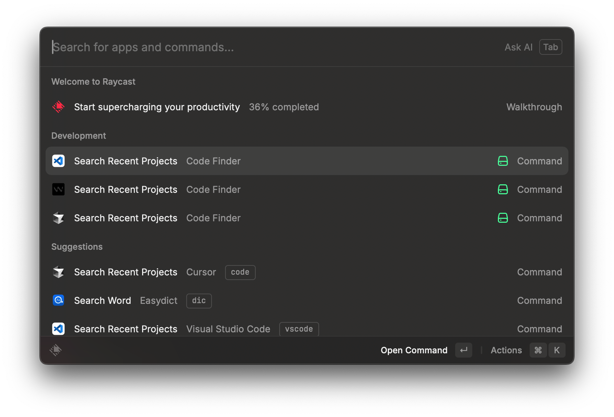

# Raycast Code Finder

A Raycast extension that aggregates recent project history from VSCode and its forks (Cursor, Windsurf) into a unified list. Quickly search through all your projects across different editors and open them with your preferred code editor.

```sh
npx rayext jinghaihan/raycast-code-finder
```

<div align="center">
  
  
</div>

## Commands

<!-- commands -->

| Title                    | Description                                                         |
| ------------------------ | ------------------------------------------------------------------- |
| `Search Recent Projects` | List recent projects from VSCode and its forks, open with VSCode.   |
| `Search Recent Projects` | List recent projects from VSCode and its forks, open with Cursor.   |
| `Search Recent Projects` | List recent projects from VSCode and its forks, open with Windsurf. |

<!-- commands -->

## Configuration

<!-- configs -->

| Key                | Description                                                              | Required | Default            |
| ------------------ | ------------------------------------------------------------------------ | -------- | ------------------ |
| `layout`           | Select the layout of the view                                            | `No`     | list               |
| `keepSectionOrder` | Keep the order of the sections while searching folders, files, etc.      | `No`     | false              |
| `terminalApp`      | Select which Terminal App to use when opening with a terminal            | `No`     | com.apple.Terminal |
| `showGitBranch`    | Display the current Git branch for files and folders in Git repositories | `No`     | true               |

<!-- configs -->

## License

[MIT](./LICENSE) License © [jinghaihan](https://github.com/jinghaihan)
